US Accidents (2016 - 2023)

Course : Data Science Name : Alireza Rahmati Student Id : 400222038

Introduction :

Every year, traffic accidents pose a significant challenge to public safety, causing injuries, loss of life, and economic impact. Understanding the underlying factors contributing to these accidents is crucial for improving road safety and reducing their frequency. In this report, we delve into a comprehensive dataset of United States traffic accidents, sourced from Kaggle, to gain insights into the patterns, causes, and potential mitigations for these incidents.

The dataset under consideration offers a rich repository of information, including details about accident severity, weather conditions, road features, and more. To embark on this analysis, we followed a systematic approach, starting with data preprocessing and exploratory data analysis to understand the dataset's structure, handle missing values, and uncover initial trends. Visualizations were employed to provide a visual snapshot of the dataset and to identify noteworthy correlations and trends.

Our focus extended to key variables such as accident severity, weather conditions, and temperature. By conducting statistical tests, we aimed to assess the significance of these factors in influencing accident outcomes. This multi-faceted analysis endeavors to shed light on various aspects of traffic accidents in the United States.

Data Preprocessing:

Preprocessing involved handling missing data, ensuring data uniformity, and transforming variables for better analysis. These crucial steps laid the foundation for meaningful insights in our study of traffic accidents.

To initiate our analysis, we began by exploring the dataset to gain a better understanding of its contents. This exploration began with an examination of the top five records in the dataset :

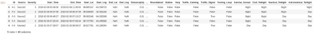

Let's examine the columns available in this dataset :

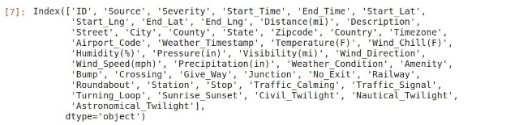

It's important to understand the purpose and format of each column, but given the dataset's extensive number of columns, I recommend referring to the Kaggle dataset documentation for detailed information.

Now, let's provide a describe of this dataset:

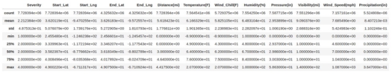

This dataset provides valuable summary statistics for its columns, including minimum, maximum, mean, and other relevant measures, which are instrumental in comprehending the dataset's characteristics.

Let's examine the presence of missing values within the dataset.

We have calculated the count of missing values for each column. While we have omitted columns unnecessary for our analysis, we have diligently addressed missing values in the columns pivotal to our research, ensuring data integrity and accuracy in our subsequent analysis.

Data Visualization :

Let's create visualizations to explore the relationship between Wind Speed, Precipitation, Visibility, and Severity, and identify any patterns or clusters in the data.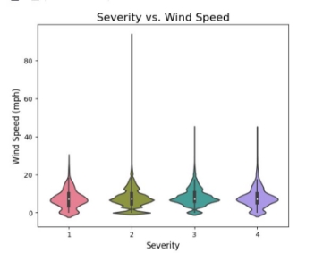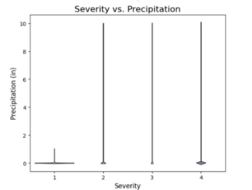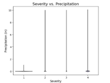

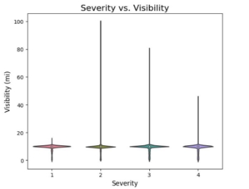

I aim to determine if there is a consistent pattern of high accident counts each year within the range of 2016 to 2023, or if the accident counts vary annually.

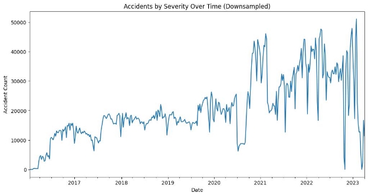

It's intriguing to observe that the 'year\_count' plot exhibits a high frequency, and the trend doesn't appear to follow a linear pattern. However, it suggests a noticeable upward trajectory,

indicating a potential annual increase in accident counts.

Let's examine the distribution of accident counts for each month, allowing us to understand the variations and patterns in accidents over the course of the year.

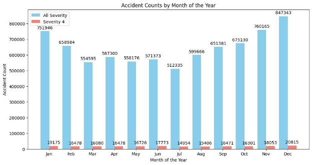Now that we've analyzed the accident counts by year and month, I'm eager to explore the time of day when accidents are most frequent, shedding light on the peak hours of accident occurrence.

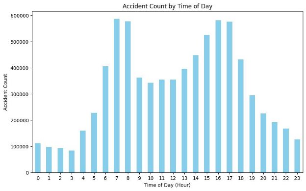

However, simply looking at accident counts is not sufficient; we need to consider the severity of the accidents as well to determine the most critical times of day for road safety.

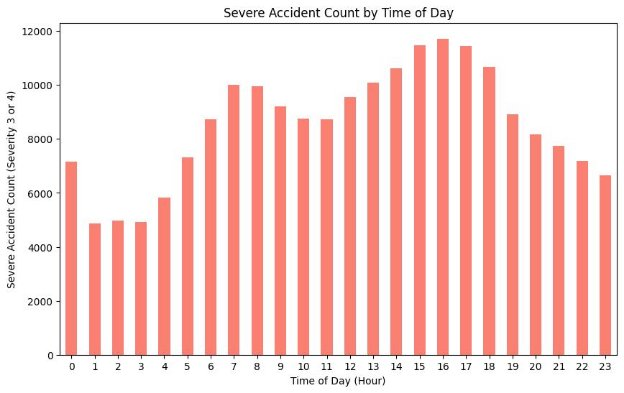It's notable that during the hours of 7 and 8 in the morning, when people are typically commuting to work or students are heading to schools or universities, we observe a substantial number of accidents. Similarly, during the hours of 17 and 18, when individuals are returning home from work, we encounter a similar high accident count. However, what sets the end of the day apart is the increased frequency of accidents with high severity. This could potentially be attributed to fatigue, as people are tired after a day's work and may have reduced energy levels during their journey home.

I'd like to explore the distribution of accident severity levels within the dataset, providing insights into the relative frequency of different severity categories among all recorded accidents.

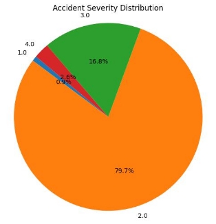

Let's examine the ten streets with the highest accident rates in the United States.

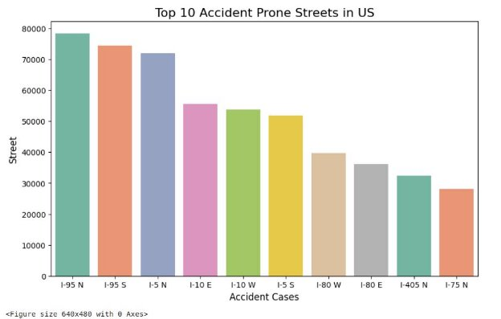

Let's explore the dataset to find the highest and lowest accident counts in the United States.

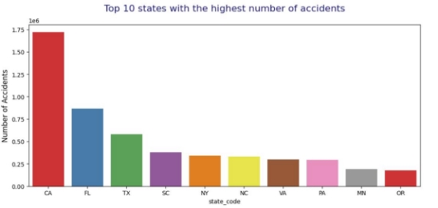

Now, let's identify the top 10 cities with the highest number of accidents.

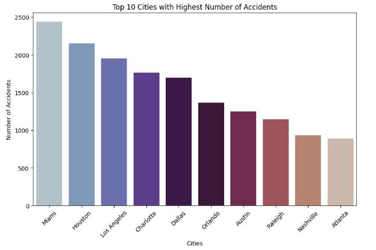

See this plot :

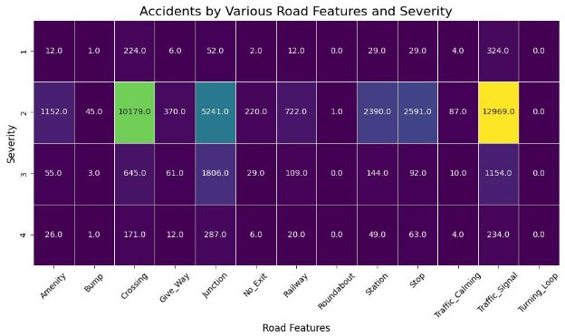This plot provides an insightful overview of accidents categorized by both road features and severity levels. By visualizing this data, we can discern the impact of different road characteristics on accident severity, helping to identify areas where road safety measures may be most needed. The plot's representation allows for a quick assessment of the relationship between specific road features and the outcomes of accidents, providing valuable information for traffic safety analysis and decision-making.

I'm curious to explore a correlation matrix for selected columns, which will allow us to assess the relationships and dependencies between these variables in the dataset.

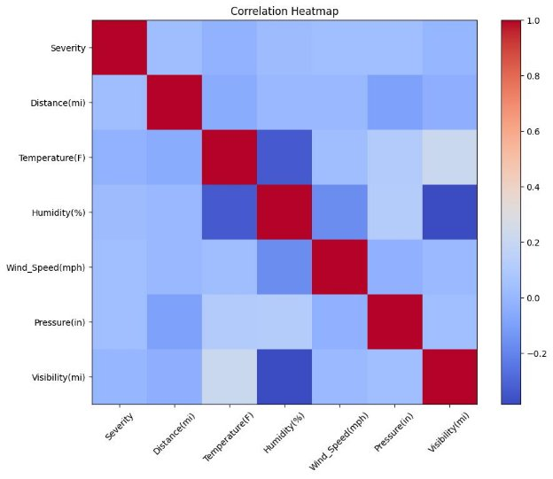

It appears that there are no highly correlated columns within the dataset, indicating a relatively low degree of linear correlation between the selected variables.

Let's examine the correlation among weather conditions to understand if any significant relationships exist between these variables.

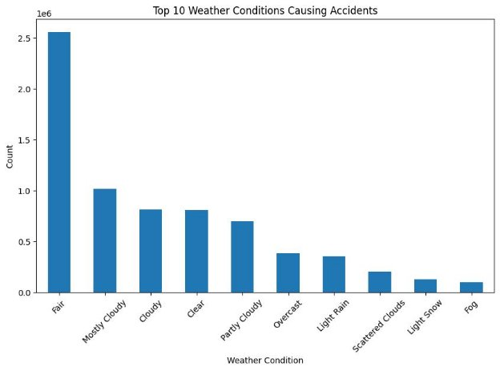

I'm interested in determining whether using 'Stop POI' or 'Traffic Calming POI' is more effective in reducing accident counts. Let's explore which one yields better results in terms of accident mitigation.

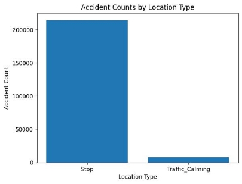

Let's visualize the accident counts for each state in the United States on a map.

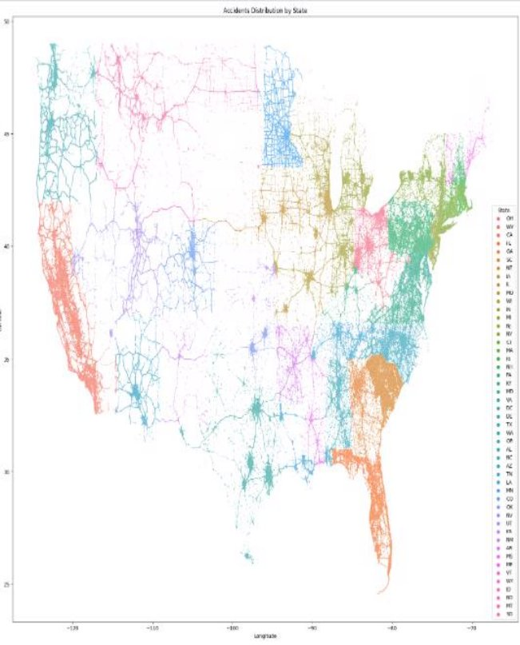

Data Analysis :

Let's examine the distribution of temperatures within the dataset.

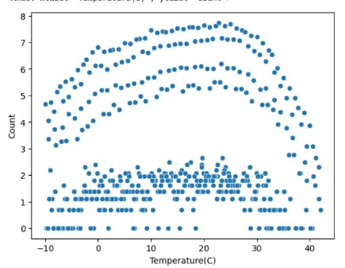

I intend to apply regression analysis to this temperature distribution to uncover the underlying data trends and growth patterns.

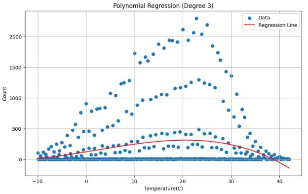
